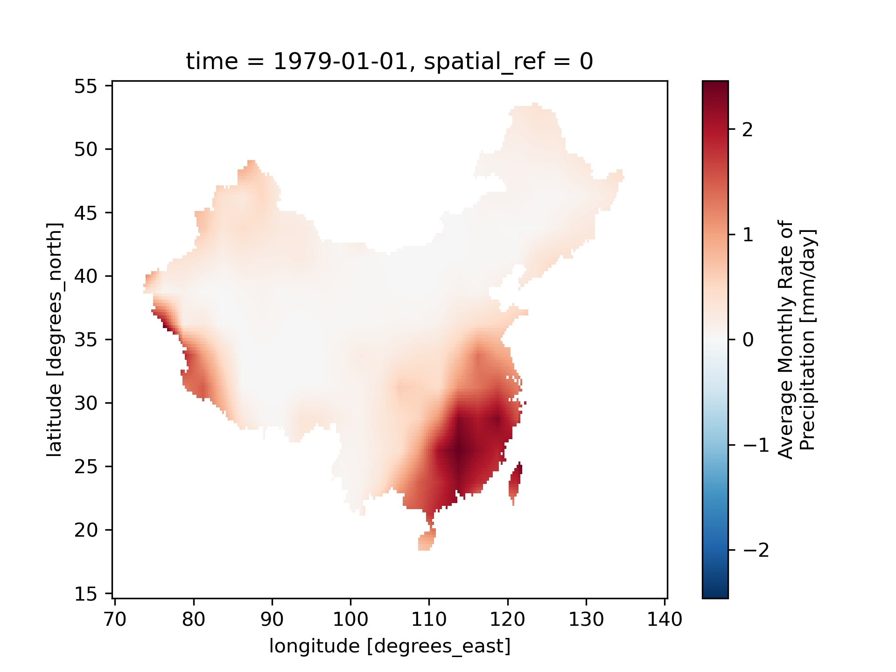

# Python 使用SHP文件剪切NC数据

## 库

`xarray` , `rioxarray` , `geopandas`

## 步骤

1. 对中国区域进行0.25*0.25的插值
2. 使用中国shp文件进行截取

## 数据

ncep降水数据 https://psl.noaa.gov/data/gridded/data.ncep.reanalysis2.html

## 代码

引入库

```Python

import numpy as np
import geopandas as gpd
import rioxarray
import xarray as xr
from shapely.geometry import mapping
import matplotlib.pyplot as plt

```

读取shp文件

```Python

shp = gpd.read_file("./data/china_shp/country1.shp")
shp = shp[shp['CNTRY_NAME']=="China"]

```
对数据进行插值和mask

```Python
precp = xr.open_dataset("./data/precip.mon.mean_197901-202105.nc")['precip'].interp(lon=np.arange(69.75,140.26,0.25),lat=np.arange(14.75,55.26,0.25))
precp.rio.write_crs("epsg:4326", inplace=True)
precp.rio.set_spatial_dims(x_dim="lon", y_dim="lat", inplace=True)
cliped = precp.rio.clip(shp.geometry.apply(mapping),shp.crs,drop=False)
cliped[0].plot()
plt.show()
```

结果如下：

